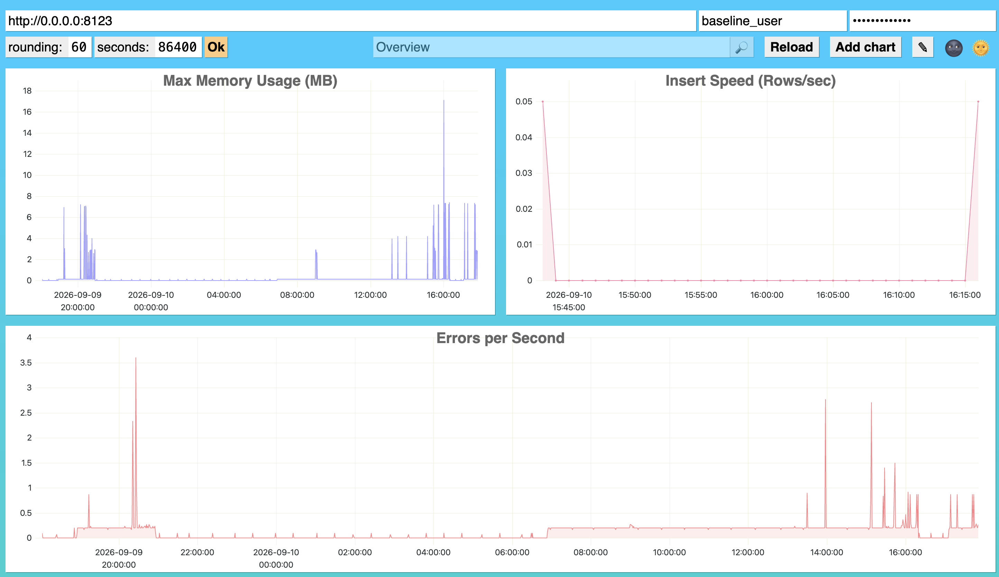

## Metrics and monitoring in Clickhouse

table with metrics

```sql
CREATE TABLE default.custom_metrics
(
    `dashboard` String,
    `title` String,
    `query` String
)
ENGINE = MergeTree
ORDER BY dashboard;

INSERT INTO default.custom_metrics (dashboard, title, query) 
VALUES
(
    'my_custom_dashboard', 
    'Errors per Second', 
    'SELECT toStartOfInterval(event_time, INTERVAL {rounding:UInt32} SECOND)::INT AS t, count() / {rounding:UInt32} AS metric FROM system.query_log WHERE type = ''ExceptionWhileProcessing'' AND event_date BETWEEN toDate(now() - {seconds:UInt32}) AND toDate(now()) AND event_time BETWEEN now() - {seconds:UInt32} AND now() GROUP BY t ORDER BY t WITH FILL STEP {rounding:UInt32}'
),
(
    'my_custom_dashboard', 
    'Max Memory Usage (MB)', 
    'SELECT toStartOfInterval(event_time, INTERVAL {rounding:UInt32} SECOND)::INT AS t, max(memory_usage) / 1048576 AS metric FROM system.query_log WHERE type = ''QueryFinish'' AND event_date BETWEEN toDate(now() - {seconds:UInt32}) AND toDate(now()) AND event_time BETWEEN now() - {seconds:UInt32} AND now() GROUP BY t ORDER BY t WITH FILL STEP {rounding:UInt32}'
),
(
    'my_custom_dashboard', 
    'Insert Speed (Rows/sec)', 
    'SELECT toStartOfInterval(event_time, INTERVAL {rounding:UInt32} SECOND)::INT AS t, sum(written_rows) / {rounding:UInt32} AS metric FROM system.query_log WHERE type = ''QueryFinish'' AND query_kind = ''Insert'' AND event_date BETWEEN toDate(now() - {seconds:UInt32}) AND toDate(now()) AND event_time BETWEEN now() - {seconds:UInt32} AND now() GROUP BY t ORDER BY t WITH FILL STEP {rounding:UInt32}'
);
```



