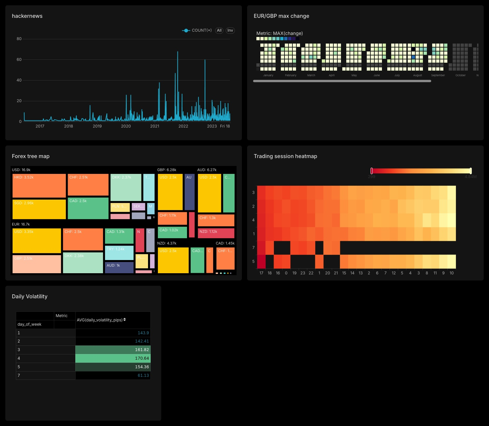

## Integration with Superset

#### docker-compose.yml


in superset pod terminal

```bash
$ uv pip install ".[clickhouse]"
$ superset fab create-admin \
  --username admin --firstname Superset --lastname Admin \
  --email admin@superset.com --password admin
```


1. Hackernews test dataset

```sql
CREATE TABLE hackernews ENGINE = MergeTree ORDER BY tuple
(
) EMPTY AS SELECT * 
    FROM url('https://datasets-documentation.s3.eu-west-3.amazonaws.com/hackernews/hacknernews.csv.gz', 'CSVWithNames');


INSERT INTO hackernews SELECT *
FROM url('https://datasets-documentation.s3.eu-west-3.amazonaws.com/hackernews/hacknernews.csv.gz', 'CSVWithNames')
```

2. Forex dataset

```sql
CREATE TABLE forex_2020s 
    ENGINE = MergeTree ORDER BY tuple
(
) EMPTY AS SELECT * 
FROM s3('https://datasets-documentation.s3.eu-west-3.amazonaws.com/forex/csv/year_month/2011*', 'CSVWithNames')
;

INSERT INTO forex_2020s SELECT *
FROM s3('https://datasets-documentation.s3.eu-west-3.amazonaws.com/forex/csv/year_month/2011*', 'CSVWithNames');
```

#### Dashboard


